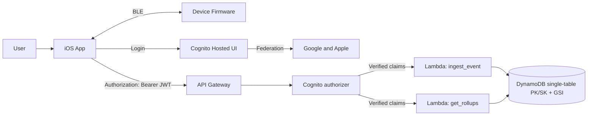

# Vetra — Pace Your Puffs, Own Your Habit®

**Built by Adeesh Devanand.**

Vetra is a **connected-device wellness system** built around a simple idea: **measure real usage, set a limit, and make the limit enforceable**. It combines a **Bluetooth-connected device**, an **iOS companion app**, and a **serverless AWS backend** that work together to help users **track usage**, **set limits**, and **enforce an auto-lock when limits are reached**—with room to expand into gradual reduction plans and longer-term behavior change features.

**Links**
- Product site: https://myvetra.ca  
- iOS app repo: https://github.com/my-vetra/app-ios  
- Firmware repo: https://github.com/my-vetra/vape-firmware  
- Cloud backend repo: https://github.com/my-vetra/cloud-aws  

---

## The product, in one minute 

Vetra is designed around three ideas: 

1) **Puff-based auto-lock** — track every puff and physically lock once a daily limit is reached.

2) **Personalized quit plan** — support gradual reduction at the user’s pace.

3) **Companion app experience** — track puff count, set limits, and review progress over time. Learn more on the product site: **myvetra.ca**

---

## How the system fits together

Vetra is intentionally split into three repos that map cleanly to the real-world system boundaries.

- **Device (Firmware)** produces and exposes **usage signals** and device state over BLE, implements the puff-based autolock using the ESP32-C3.
- **iOS App** is the **primary user experience**: pairing, settings, history, and optional sync.
- **Cloud Backend (AWS)** provides **authenticated ingestion + rollups** so usage history can be safely stored, queried, and extended into analytics, leaderboard sync, or future services.

---

## System overview

---

## End-to-end flows

### 1) Pairing and device data collection (Device → iOS)
1. The user opens the iOS app and starts pairing.
2. The app discovers the device over BLE and establishes a secure connection (BLE pairing/connection flow).
3. The firmware exposes device state and usage data over BLE characteristics.
4. The app parses the incoming BLE data into app-level domain events (e.g., puffs/sessions) and updates the UI in real time.
5. Usage history is stored locally so the app remains useful offline.

### 2) Setting and enforcing limits (iOS → Device)
1. The user selects a limit in the iOS app (e.g., daily puff limit).
2. The app writes the configuration to the device over BLE (or applies it locally depending on the design).
3. The firmware uses this configuration to determine when to transition into a restricted state.
4. When the limit is reached, the device enters an **auto-lock** (enforcement) state and can optionally expose a reason/status to the app.

### 3) Authenticated sync + analytics (iOS → Cloud)
1. The user authenticates through **Cognito Hosted UI** using **OAuth2 authorization code flow** (with optional Google/Apple sign-in).
2. The app obtains a JWT access token and calls the serverless API.
3. The backend validates requests, enforces throttles/guardrails, and ingests usage events.
4. Events are written to DynamoDB and rollups are updated atomically, enabling fast “daily/weekly” views.

---

## Repositories

### 1) iOS App — `app-ios`
Repo: https://github.com/my-vetra/app-ios

**Purpose**
- Primary user experience: pairing, settings, usage history, and optional cloud sync.
- Converts BLE packets into meaningful user-facing metrics and timelines.

**Typical responsibilities**
- BLE discovery + connection management (reconnect, timeouts, state transitions)
- Parsing device messages into events (puffs/sessions)
- Local persistence (so history and settings survive restarts / offline usage)
- UI for:
  - current day usage
  - history and trends
  - limit configuration
  - device status (connected/locked/battery)

**How it interacts with other repos**
- Talks to `vape-firmware` over BLE.
- Sends authenticated events to `cloud-aws` when cloud sync is enabled.

**Where to start**
- `README.md` in `app-ios`
- BLE manager / device service layer
- Data model + persistence layer
- Screens/UI that represent the core tracking + limits experience

---

### 2) Firmware — `vape-firmware`
Repo: https://github.com/my-vetra/vape-firmware

**Purpose**
- Runs on the device microcontroller and implements the “source of truth” for device state.
- Emits usage signals, supports BLE communication, and participates in enforcement (auto-lock).

**Typical responsibilities**
- Puff counting / session state machine
- Debouncing / signal conditioning (to avoid noisy events being counted incorrectly)
- BLE services and characteristics to expose:
  - usage counters / session data
  - lock state
  - configuration from the app
  - diagnostics/logging (optional but valuable)
- Low-power lifecycle (sleep/wake) to support battery life

**How it interacts with other repos**
- Exposes data to `app-ios` over BLE.
- Can optionally accept configuration from `app-ios` to drive enforcement logic.

**Where to start**
- BLE service definitions
- Core state machine for counting + lock transitions
- Power management and reliability logic

---

### 3) Cloud Backend (AWS) — `cloud-aws`
Repo: https://github.com/my-vetra/cloud-aws

**Purpose**
- Auth + ingestion + rollups layer for usage history and analytics.
- Provides a clean interface for the app to store and query usage data.

**Key capabilities**
- **API Gateway + Lambda + DynamoDB** serverless backend
- **JSON Schema request validation**
- **Rate limiting / throttles** and payload-size controls
- **Operational guardrails** (logging/metrics/alarms depending on implementation)
- **Cognito User Pools** with **Google/Apple federation**
- **OAuth2 authorization code flow**
- **RBAC via Cognito authorizer** on API Gateway (verified claims passed to Lambda)
- DynamoDB **single-table access patterns (PK/SK + GSI)** with:
  - conditional writes
  - transactional writes to atomically ingest events and update rollups

**How it interacts with other repos**
- Receives events from `app-ios` and returns rollups back to the app.

**Where to start**
- `README.md` in `cloud-aws`
- IaC templates and deployment flow
- Data model documentation (PK/SK/GSI patterns)
- Endpoint handlers for ingest + rollups

---

## How to run the whole ecosystem (high level)

This is the “portfolio path” to understand Vetra end-to-end.

1) **Firmware**
- Flash the firmware to the device hardware (see `vape-firmware` for toolchain + steps).
- Confirm the device advertises over BLE and exposes expected characteristics.

2) **iOS app**
- Build and run `app-ios` in Xcode on a device (BLE is best tested on physical iPhone).
- Pair with the device and verify:
  - live updates
  - limit changes
  - lock state visibility

3) **Cloud backend**
- Deploy `cloud-aws` to a dev stage in AWS.
- Configure auth callbacks for the iOS app.
- Enable cloud sync in the app and verify:
  - event ingestion succeeds
  - rollups query returns expected daily totals

---

## Recognition
- Runner-up, V2RF Pitch Competition (2025)
- Round-2, New Ventures BC (2025)

---

## Contact
Product site: https://myvetra.ca

---

### Credits
Built by **Adeesh Devanand**.
